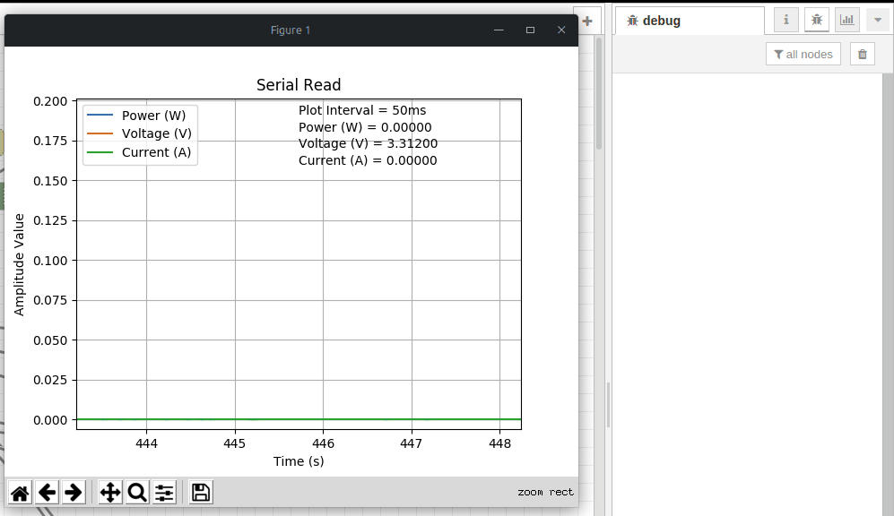

The device operation utilizes the parameters defined by the `Monster Configuration` used in build compilation.

The device operates by running through the following steps:

1. Wake Up
2. Read Sensor
3. Initialize and connect to WiFi
4. Initialize and send HTTP Post request
5. Deinitialize HTTP and WiFi
6. Enter into Deep Sleep and repeat

## Receiving Data

